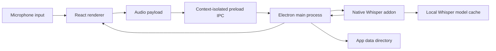

# ASR Pro

<p align="center">
  
</p>

<p align="center">
  <strong>Private desktop speech transcription with local Whisper models.</strong>
</p>

<p align="center">
  
  
  
  
  
</p>

ASR Pro is a cross-platform desktop transcription workspace for recording speech, running recognition locally, and keeping transcript history, model files, settings, and logs under app-owned storage. It uses an Electron desktop runtime, a React/Vite renderer, and `@kutalia/whisper-node-addon` for native Whisper transcription.

The default recognition model is **Whisper Base English**. Additional Whisper models can be downloaded, selected, and removed from the in-app Models library.

## Preview

<p align="center">
  
</p>

## What It Does

| Area | Capability |
|---|---|
| Local transcription | Records microphone audio, converts it for recognition, and transcribes through the native Whisper engine. |
| Model control | Ships with a model library for Whisper Tiny English, Base English, Base Multilingual, Small English, and Large v3 Turbo. |
| Private history | Keeps recent transcript history locally, including playable source recordings when available. |
| Desktop workflow | Provides a tray menu, global recording shortcut, fixed-size desktop shell, and floating recording waveform overlay. |
| Portable storage | Keeps Windows and Linux packaged data beside the executable. macOS uses standard app support paths when installed in Applications folders. |
| Release packaging | Builds macOS, Windows, and Linux desktop artifacts with Electron Builder and bundled native runtime resources. |

## Project Status

| Track | Status |
|---|---|
| Desktop runtime | Electron main/preload with context-isolated IPC. |
| Recognition engine | Native Whisper addon with lazy model download and checksum validation. |
| Default model | `whisper-base-en`, Whisper Base English. |
| Release version | `1.0.1`. |
| Public license | Not declared yet. Add a `LICENSE` file before accepting external contributions or presenting this as reusable open-source software. |

## Screenshots

| Home | Configuration |
|---|---|
|  |  |

| Sound | Models Library |
|---|---|
|  |  |

| History | About |
|---|---|
|  |  |

## Features

| Feature | Details |
|---|---|
| Recording controls | Start and stop recording from Home, tray, or `CommandOrControl+\``. |
| Microphone selection | Choose the input device from the toolbar or Sound screen, with a refresh action for device changes. |
| Floating overlay | Shows a compact waveform while recording. Placement can be top, bottom, or a remembered dragged position. |
| Transcript history | Stores recent transcript rows locally, supports search, copy, delete, text-file opening, and reprocessing saved audio clips. |
| Auto-copy | Completed transcripts can be copied to the clipboard automatically. |
| Text editor preference | Transcript text files can open with the system default editor, TextEdit, VS Code, or Cursor when available. |
| Startup launch | The Configuration screen can register ASR Pro to start at login and repair the target path after a portable install moves. |
| Resource visibility | The Models library reports local model storage and runtime memory groups exposed by the Electron runtime. |

## Models

Models are downloaded from the whisper.cpp GGML model release location when first needed or when requested from the Models library. Files are stored under the app data model cache and verified with SHA-1 before use.

| Model | Identifier | File | Size | Use |
|---|---|---|---:|---|
| Whisper Tiny English | `whisper-tiny-en` | `ggml-tiny.en.bin` | 75 MB | Fastest English dictation with the lowest memory use. |
| Whisper Base English | `whisper-base-en` | `ggml-base.en.bin` | 142 MB | Default local English model. |
| Whisper Base Multilingual | `whisper-base` | `ggml-base.bin` | 142 MB | Small multilingual model with automatic language detection. |
| Whisper Small English | `whisper-small-en` | `ggml-small.en.bin` | 466 MB | Better English accuracy at a higher resource cost. |
| Whisper Large v3 Turbo | `whisper-large-v3-turbo` | `ggml-large-v3-turbo.bin` | 1.5 GiB | Highest-accuracy bundled option with faster large-model decoding. |

## Privacy And Storage

ASR Pro is designed around local desktop ownership. The transcription path does not call an external transcription API. The app only needs network access when downloading a selected Whisper model.

| Data | Location |
|---|---|
| Whisper models | `models/whisper/` inside the app data directory. |
| Transcript text files | `transcripts/` inside the app data directory. |
| Settings | `config/` inside the app data directory. |
| Electron user data | `user-data/` inside the app data directory. |
| Logs and session data | `logs/` and `session/` inside the app data directory. |
| Temporary transcription audio | Written to a temporary Electron path for the native engine, then removed after transcription. |

See [Portable data](docs/portable-data.md) for the platform-specific folder map and move checklist.

## Requirements

| Dependency | Development | Packaged App |
|---|---:|---:|
| Node.js | 20.19+ or 22.12+ | Not required |
| npm | Required | Not required |
| Git | Required for source checkout | Not required |
| OS | macOS, Windows, or Linux | macOS, Windows, or Linux |

## Quick Start

```bash
git clone https://github.com/surajmandalcell/asrpro.git
cd asrpro
npm install
npm run electron:dev
```

`npm run electron:dev` starts the Vite renderer on `127.0.0.1:4270`, waits for it to become available, and opens the Electron app. The Whisper engine is lazy-loaded, so the selected model is downloaded and initialized only when transcription or model setup requests it.

## Development Commands

| Command | Purpose |
|---|---|
| `make dev` | Start the Electron desktop app through `npm run electron:dev`. |
| `make help` | Show the supported Make targets. |
| `npm run dev` | Start the Vite renderer on `127.0.0.1:4270`. |
| `npm run preview` | Preview the production renderer on `127.0.0.1:4271`. |
| `npm run build` | Type-check and build renderer assets. |
| `npm test -- --run` | Run the Vitest suite once. |
| `npm run engine:check` | Verify the native Whisper addon can be loaded. |
| `npm run screenshots:readme` | Refresh the product screenshot set and run screenshot validation. |
| `npm run screenshots:check` | Validate screenshot and evidence image dimensions. |
| `npm run electron:pack` | Build renderer assets, check the engine, and create an unpacked app for the current OS. |
| `npm run electron:dist` | Build configured installer/package artifacts for the current OS. |

## Release Builds

Build release artifacts on the target operating system so the bundled native addon matches the platform being packaged.

```bash
npm install
npm run electron:pack
```

| Platform | Command | Electron Builder targets |
|---|---|---|
| macOS | `make build:mac` | DMG, ZIP, unpacked app |
| Windows x64 | `make build:win` | NSIS installer, portable executable |
| Linux x64 | `make build:linux` | AppImage, DEB, RPM, tar.gz |

Release output is written to `release/`. Code signing, notarization, store submission, and distribution credentials are intentionally outside this repository.

## Architecture

| Layer | Stack | Responsibility |
|---|---|---|
| Renderer | React 19, TypeScript, Vite, Tailwind, lucide-react | App shell, recording controls, model selection, history, settings, screenshots, and visual state. |
| Desktop runtime | Electron main/preload, secure IPC | Window lifecycle, tray menu, global shortcut, overlay window, startup registration, transcript file operations, and runtime state. |
| Audio capture | Browser MediaRecorder and Web Audio APIs | Microphone capture, live audio level monitoring, and transcription payload generation. |
| ASR engine | `@kutalia/whisper-node-addon`, whisper.cpp GGML model files | Model download, checksum validation, native transcription, and selected model execution. |
| Packaging | electron-builder, custom after-pack cleanup | Platform packaging, native addon bundling, icon resources, and unused native binary cleanup. |

### Runtime Flow



## Configuration

| Variable | Default | Use |
|---|---|---|
| `ASRPRO_DATA_DIR` | Electron-resolved app data path | Overrides app data, model cache, transcript, config, session, log, and cache storage. |
| `ASRPRO_DEFAULT_MODEL` | `whisper-base-en` | Exposes the runtime default model identifier. |
| `ASRPRO_SCREENSHOT_MODE` | unset | Seeds deterministic local UI data for screenshot capture. |

Startup launch is controlled from Configuration, Application, `Launch at startup`. See [Startup launch](docs/startup.md) for how ASR Pro replaces the saved startup target when an install moves.

## Runtime API

The renderer only reaches desktop capabilities through the context-isolated `window.asrpro` preload API.

| API | Purpose |
|---|---|
| `getRuntimeState` | Read app paths, model list, storage stats, settings, overlay settings, engine state, and shortcut state. |
| `getModels` | Read available Whisper models and local cache status. |
| `downloadModel` | Download and verify a selected model. |
| `deleteModel` | Remove a selected local model file. |
| `transcribeAudio` | Transcribe renderer-provided audio with the selected model. |
| `openTranscriptText` | Write transcript text to the app data folder and open it with the configured editor. |
| `setStartupLaunch` | Enable or disable login startup for the current executable path. |
| `setOverlaySettings` | Persist recording overlay placement. |
| `onRecordingState` | Subscribe to tray, shortcut, and app recording state changes. |
| `onEngineState` | Subscribe to engine downloading, transcribing, ready, and error states. |

## Quality Gates

Run these before shipping a release candidate:

```bash
npm run build
npm test -- --run
npm run engine:check
npm run screenshots:check
npm run electron:pack
```

| Gate | What it proves |
|---|---|
| `npm run build` | TypeScript and production renderer compile successfully. |
| `npm test -- --run` | Renderer behavior, Electron runtime helpers, packaging assumptions, model handling, and UI interactions pass. |
| `npm run engine:check` | The installed native Whisper addon can be loaded by Node. |
| `npm run screenshots:check` | README screenshots and evidence images have the expected dimensions and naming. |
| `npm run electron:pack` | Electron Builder can assemble the current OS app with bundled runtime resources. |
| Manual packaged smoke | The packaged app opens, has no console errors, loads Home, Configuration, Sound, Models, History, and About, and can run a real transcription input. |

## Repository Layout

```text
asrpro/
├── docs/
│   ├── portable-data.md      # App-contained data behavior and move checklist
│   ├── startup.md            # Login startup behavior by platform
│   └── screenshots/          # Product screenshots used by this README
├── electron/                 # Electron main, preload, overlay, identity, runtime, and Whisper helpers
├── scripts/                  # Build, screenshot, packaging, and native engine checks
├── src/                      # React renderer, app shell, services, assets, and tests
├── DESIGN.md                 # Desktop design system notes
├── Makefile                  # Operator entrypoints
├── package.json              # App metadata, scripts, dependencies, and Electron Builder config
└── vite.config.ts            # Renderer build and local dev server configuration
```

## Project Documentation

| Document | Purpose |
|---|---|
| [Portable data](docs/portable-data.md) | Explains `asrpro-data/`, platform storage rules, and how to move an install safely. |
| [Startup launch](docs/startup.md) | Explains the Configuration toggle, platform startup targets, and moved-install repair behavior. |
| [Design system](DESIGN.md) | Captures the compact graphite desktop UI direction, spacing, colors, icon rules, and shell behavior. |

## Maintaining Screenshots

Use the automated screenshot path when UI changes affect the README gallery.

```bash
npm run screenshots:readme
```

| Output | Purpose |
|---|---|
| `docs/screenshots/*.png` | Product screenshots displayed in this README. |
| `_evidence/*.jpg` | Review evidence for screenshot capture and validation. |
| `npm run screenshots:check` | Confirms expected image sizes and evidence naming. |

## Contributing

External contribution policy is intentionally conservative until a public license and maintainer process are added.

| Before opening work | Expectation |
|---|---|
| Discuss large changes | Open an issue before changing engine, storage, packaging, or release behavior. |
| Keep runtime local-first | Do not add hosted transcription, analytics, or telemetry without explicit maintainer approval. |
| Respect app data rules | Preserve portable data behavior and avoid deleting user-owned `asrpro-data/` paths. |
| Verify the app | Run the relevant quality gates before submitting changes. |
| Keep docs professional | README text should describe shipped behavior, not internal notes, temporary capture details, or placeholder project language. |

## Troubleshooting

| Symptom | Fix |
|---|---|
| Vite refuses to start | Port `4270` is already in use. Stop the existing process or use `npm run preview` on `4271` for renderer-only checks. |
| First transcription is slow | The selected Whisper model may be downloading or initializing. Download the model from the Models library before recording when predictable startup matters. |
| Model download fails | Check network access, retry setup, or select an already downloaded model. Failed partial downloads use a `.download` suffix and are cleaned by retry/delete flows. |
| Native engine check fails | Run `npm install` again and confirm the installed native addon supports the current OS and CPU architecture. |
| Startup launches an old copy | Open the moved app, then toggle `Launch at startup` off and on from Configuration. |
| A transcript opens in the wrong editor | Change Configuration, Application, `Transcript editor`, then open the transcript again from History. |

## Security And Privacy Notes

| Boundary | Current behavior |
|---|---|
| Transcription | Runs through the native Whisper engine in the local Electron process. |
| Model downloads | Uses the whisper.cpp model URL only when a model is requested and not already installed. |
| Transcript files | Written inside the app data folder and guarded against deletion outside the transcript directory. |
| Browser surface | Uses context isolation and a narrow preload API instead of exposing Node directly to the renderer. |
| Telemetry | No telemetry or analytics integration is present in the current codebase. |

## License

No public license is currently declared. Until a `LICENSE` file is added, the repository is source-available for review but does not grant open-source reuse rights.

## Maintainer

Suraj Mandal
