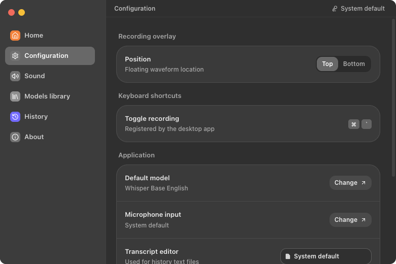
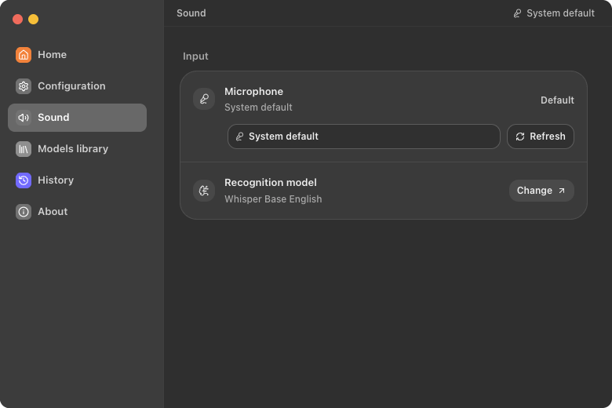
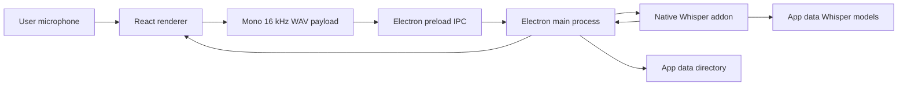

# ASR Pro

<p align="center">
  
</p>

<p align="center">
  <strong>Local-first desktop transcription for private dictation, file transcription, and speech model testing.</strong>
</p>

<p align="center">
  
  
  
  
</p>

ASR Pro is a cross-platform desktop app built with Electron, React, Vite, and a native Node Whisper engine. The current default model is Whisper Base English. Smaller and multilingual Whisper options are selectable in the model library.

## Screenshots

| Home | Configuration |
|---|---|
|  |  |

| Sound | Models |
|---|---|
|  |  |

| History | About |
|---|---|
|  |  |

## Highlights

| Area | Capability |
|---|---|
| Desktop shell | Fixed-size Electron window, custom macOS-style traffic lights, tray integration, and context-isolated preload APIs. |
| Recording workflow | Microphone picker, global recording shortcut, floating waveform overlay, and saved local transcript history. |
| Transcription | Browser-side capture converts recordings to mono 16 kHz WAV and sends them to the Electron main process through secure IPC. |
| Models | Whisper Tiny English, Whisper Base English, Whisper Small English, and Whisper Base Multilingual are available through the native engine. |
| Lazy loading | The app starts without loading a speech model. Model download and initialization happen only when transcription is requested. |
| Packaging | Electron Builder packages renderer assets, Electron main/preload files, app icons, tray assets, and the native Whisper addon. |

## Architecture

| Layer | Stack | Responsibility |
|---|---|---|
| Renderer | React 19, TypeScript, Vite, Tailwind, lucide-react | App shell, recording controls, history, model selection, settings, and visual state. |
| Desktop runtime | Electron main/preload, secure IPC | Window lifecycle, tray, global shortcut, overlay window, model paths, and transcription dispatch. |
| ASR engine | `@kutalia/whisper-node-addon`, whisper.cpp model files | Lazy model download, checksum validation, native transcription, and selected model execution. |
| Release | electron-builder | Produces the desktop app and bundles the native addon required by the current OS. |

### Runtime Flow



## Models

| Model | Identifier | File | Use |
|---|---|---|---|
| Whisper Tiny English | `whisper-tiny-en` | `ggml-tiny.en.bin` | Fastest English dictation. |
| Whisper Base English | `whisper-base-en` | `ggml-base.en.bin` | Default English model. |
| Whisper Small English | `whisper-small-en` | `ggml-small.en.bin` | Higher accuracy English model with slower load and transcription. |
| Whisper Base Multilingual | `whisper-base` | `ggml-base.bin` | General multilingual transcription. |
| Whisper Large v3 Turbo | `whisper-large-v3-turbo` | `ggml-large-v3-turbo.bin` | Highest-accuracy bundled option with faster large-model decoding. |

Models can be downloaded or deleted individually from the Models library. They are also downloaded lazily into the app-owned data directory when a selected model is first used.

## Requirements

| Dependency | Development | Production user |
|---|---:|---:|
| Node.js | 20.19+ or 22.12+ | Not required |
| npm | Required | Not required |
| Git | Required | Not required |
| OS | macOS, Windows, or Linux | macOS, Windows, or Linux |

## Quick Start

```bash
git clone https://github.com/surajmandalcell/asrpro.git
cd asrpro
npm install
npm run electron:dev
```

The development command starts Vite on `127.0.0.1:4270` and opens the Electron app as soon as the renderer is ready. The speech model is loaded only when the user records and requests transcription.

## Commands

| Command | Purpose |
|---|---|
| `make dev` | Start the Electron desktop app through `npm run electron:dev`. |
| `npm run dev` | Start the Vite renderer on `127.0.0.1:4270`. |
| `npm run preview` | Preview the production renderer on `127.0.0.1:4271`. |
| `npm run engine:check` | Verify the native Whisper addon can be loaded. |
| `npm run build` | Type-check and build renderer assets. |
| `npm test -- --run` | Run the Vitest suite once. |
| `npm run electron:pack` | Build renderer assets, check the engine, and create an unpacked Electron app for the current OS. |
| `npm run electron:dist` | Build configured installers/packages for the current OS. |

## Production Build

Build releases on the target operating system so the native addon matches the platform being packaged.

```bash
npm install
npm run electron:pack
```

| Platform | Electron Builder targets |
|---|---|
| macOS | DMG, ZIP, unpacked app |
| Windows | NSIS, portable executable |
| Linux | AppImage, DEB, RPM, tar.gz |

Release output is written to `release/`. Code signing, notarization, and store submission credentials are intentionally outside the repository and should be supplied by the release environment.

## Data And Runtime Paths

| Mode | Data path behavior |
|---|---|
| Development | Electron keeps local state under `tmp/app-data`. |
| Packaged app | Electron resolves the user-writable app data path, then stores ASR Pro data under its `data/` child directory. |
| Models | Whisper model files are stored under the app data model cache. |
| Logs and session data | Logs, Chromium session data, config, and overlay settings are kept under the app-owned data directory. |

## Configuration

| Variable | Default | Use |
|---|---|---|
| `ASRPRO_DATA_DIR` | Electron-provided app data path | Overrides app data, model cache, and temporary transcription storage. |
| `ASRPRO_DEFAULT_MODEL` | `whisper-base-en` | Default model identifier exposed to the runtime. |
| `ASRPRO_SCREENSHOT_MODE` | unset | Seeds deterministic local UI data for README screenshot capture. |

## IPC Surface

| API | Purpose |
|---|---|
| `getRuntimeState` | Read app paths, model list, overlay settings, and engine state. |
| `getModels` | Read available native Whisper models and local cache status. |
| `transcribeAudio` | Transcribe a renderer-provided audio payload with the selected model. |
| `onEngineState` | Subscribe to engine loading, downloading, transcribing, ready, and error states. |

## Quality Gates

Run these before shipping a release candidate:

```bash
npm run build
npm test -- --run
npm run engine:check
npm run electron:pack
```

| Gate | What it proves |
|---|---|
| `npm run build` | TypeScript and production renderer compile successfully. |
| `npm test -- --run` | Renderer, Electron runtime helpers, packaging config, and UI interaction tests pass. |
| `npm run engine:check` | The native Whisper dependency can be required by Node. |
| `npm run electron:pack` | Electron Builder can assemble the current OS app with bundled runtime resources. |
| Manual runtime smoke | The packaged or previewed app loads, has no console errors, and can navigate Home, Configuration, Sound, Models, History, and About. |

## Repository Layout

```text
asrpro/
├── docs/screenshots/       # README screenshots captured from the current app UI
├── electron/               # Electron main, preload, overlay, identity, runtime, and Whisper engine helpers
├── scripts/                # Screenshot and native engine validation helpers
├── src/                    # React renderer, app shell, assets, services, and Vitest tests
├── Makefile                # Small operator entrypoints
├── package.json            # App metadata, scripts, dependencies, and Electron Builder config
└── vite.config.ts          # Renderer build and local dev server configuration
```

## Brand And Asset Inventory

| Asset | Path | Use |
|---|---|---|
| Logo SVG | `src/assets/asrpro-logo.svg` | README, About view, and scalable app branding. |
| Logo PNG | `src/assets/asrpro-logo.png` | Raster previews and external surfaces. |
| Logo mark SVG | `src/assets/asrpro-logo-mark.svg` | Compact D07 mark used inside the app shell. |
| macOS Dock icon | `src/assets/asrpro-app-icon.icns`, `src/assets/asrpro-app-icon.png` | Packaged app icon plus development Dock icon override for `make dev`. |
| Windows app and tray icons | `src/assets/asrpro-app-icon.ico`, `src/assets/asrpro-tray-dark.ico`, `src/assets/asrpro-tray-light.ico` | Electron Builder executable/taskbar icon and Windows tray icons. |
| Linux app icons | `src/assets/linux-icons/*.png` | Size-labelled PNG icon set for Linux desktop/package integration. |
| macOS/Linux tray icons | `src/assets/asrpro-tray-dark.png`, `src/assets/asrpro-tray-light.png` | Native tray/menu glyphs where PNG tray assets are expected. |
| Screenshots | `docs/screenshots/*.png` | Production README gallery. |

## Troubleshooting

| Symptom | Fix |
|---|---|
| Vite refuses to start | Port `4270` is already in use. Stop the existing process or run `npm run preview` on `4271` for renderer-only checks. |
| First transcription is slow | The selected Whisper model may be downloading or initializing. Pre-cache models on release machines when needed. |
| Model download fails | Check network access, then retry the transcription or select a model already present in the app data directory. |
| Native engine check fails | Run `npm install` again and confirm the installed native addon supports the current OS and CPU architecture. |

## License

No public license file is currently tracked. All rights are reserved unless a license is added to the repository.

## Maintainer

Suraj Mandal
