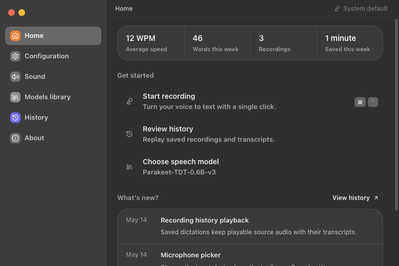
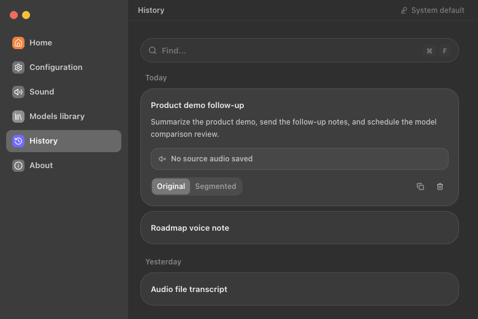
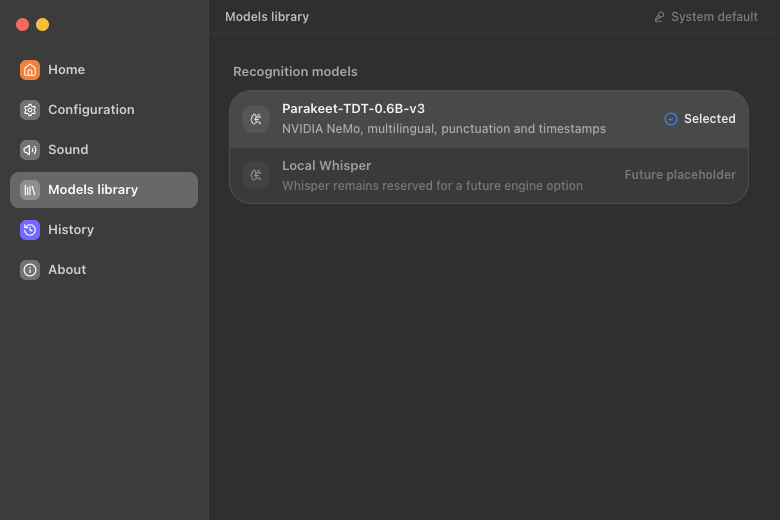
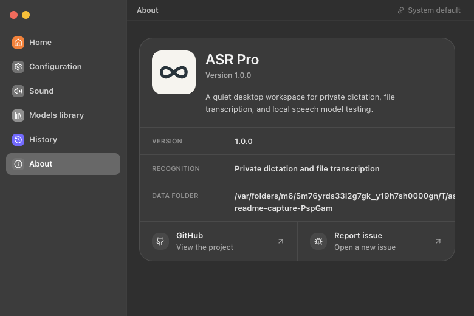
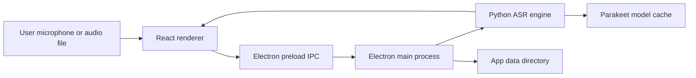

# ASR Pro

<p align="center">
  
</p>

<p align="center">
  <strong>Local-first desktop transcription for private dictation, file transcription, and speech model testing.</strong>
</p>

<p align="center">
  
  
  
  
</p>

ASR Pro is a cross-platform desktop app built with Electron, React, Vite, and a local Python ASR engine. Parakeet-TDT-0.6B-v3 is the current default and only enabled recognition model. Whisper remains only as disabled future placeholder metadata.

## Screenshots

| Home | History |
|---|---|
|  |  |

| Models | About |
|---|---|
|  |  |

## Highlights

| Area | Capability |
|---|---|
| Desktop shell | Fixed-size Electron window, custom macOS-style traffic lights, tray integration, and context-isolated preload APIs. |
| Recording workflow | Microphone picker, global recording shortcut, floating waveform overlay, and saved local transcript history. |
| Transcription | Browser-side capture posts audio to the local Parakeet engine through OpenAI-compatible transcription endpoints. |
| Models | Parakeet-TDT-0.6B-v3 is the only enabled model for now. Whisper is kept as a disabled future placeholder. |
| Local data | App-owned data directory for config, logs, model cache, session data, and transcripts. |
| Packaging | Electron Builder packages renderer assets, Electron main/preload files, app icons, tray assets, and the platform ASR engine binary. |

## Architecture

| Layer | Stack | Responsibility |
|---|---|---|
| Renderer | React 19, TypeScript, Vite, Tailwind, lucide-react | App shell, recording controls, history, model selection, settings, and visual state. |
| Desktop runtime | Electron main/preload, secure IPC | Window lifecycle, tray, global shortcut, overlay window, engine process management, and app paths. |
| ASR engine | Python, FastAPI, NeMo, Torch | Health checks, Parakeet model loading, model guardrails, and `/v1/audio/transcriptions`. |
| Release | electron-builder, PyInstaller | Produces the desktop app and bundles the ASR engine executable under Electron resources. |

### Runtime Flow



## Requirements

| Dependency | Development | Production user |
|---|---:|---:|
| Node.js | 20.19+ or 22.12+ | Not required |
| npm | Required | Not required |
| Python | 3.10-3.12 recommended for NeMo/Torch | Not required when the engine is bundled |
| Git | Required | Not required |
| OS | macOS, Windows, or Linux | macOS, Windows, or Linux |

Production installers should include a platform-specific ASR engine executable before packaging. End users should not need to install Python manually.

## Quick Start

```bash
git clone https://github.com/surajmandalcell/asrpro.git
cd asrpro
npm install
npm run sidecar:setup
npm run electron:dev
```

The development command starts the local ASR engine on `127.0.0.1:8000`, Vite on `127.0.0.1:4270`, and the Electron app once both services are healthy.

## Commands

| Command | Purpose |
|---|---|
| `make dev` | Start the Electron desktop app through `npm run electron:dev`. |
| `npm run dev` | Start the Vite renderer on `127.0.0.1:4270`. |
| `npm run preview` | Preview the production renderer on `127.0.0.1:4271`. |
| `npm run sidecar:setup` | Create or refresh the Python ASR engine environment from `sidecar/requirements.txt`. |
| `npm run sidecar:dev` | Ensure the engine environment, then start `sidecar/main.py`. |
| `npm run sidecar:build` | Build the current-platform engine executable with PyInstaller. |
| `npm run sidecar:check` | Verify the packaged engine executable exists. |
| `npm run build` | Type-check and build renderer assets. |
| `npm test -- --run` | Run the Vitest suite once. |
| `npm run electron:pack` | Build renderer assets and create an unpacked Electron app for the current OS. |
| `npm run electron:dist` | Build configured installers/packages for the current OS. |

## Production Build

Build releases on the target operating system so the engine executable matches the platform being packaged.

```bash
npm install
npm run sidecar:setup
npm run sidecar:build
npm run sidecar:check
npm run electron:pack
```

| Platform | Required engine binary | Electron Builder targets |
|---|---|---|
| macOS | `sidecar/bin/asrpro-sidecar` | DMG, ZIP, unpacked app |
| Windows | `sidecar/bin/asrpro-sidecar.exe` | NSIS, portable executable |
| Linux | `sidecar/bin/asrpro-sidecar` | AppImage, DEB |

Release output is written to `release/`. Code signing, notarization, and store submission credentials are intentionally outside the repository and should be supplied by the release environment.

## Data And Runtime Paths

| Mode | Data path behavior |
|---|---|
| Development | Electron keeps local state under `tmp/app-data`. The engine falls back to `data/` when launched directly. |
| Packaged app | Electron resolves the user-writable app data path, then stores ASR Pro data under its `data/` child directory. |
| Models | Hugging Face, NeMo, Torch, and ONNX model caches are redirected under the app data model cache. |
| Logs and session data | Logs, Chromium session data, config, and overlay settings are kept under the app-owned data directory. |

## Configuration

| Variable | Default | Use |
|---|---|---|
| `VITE_ASRPRO_API_URL` | `http://127.0.0.1:8000` | Renderer API base URL for the local ASR engine. |
| `ASRPRO_DATA_DIR` | Electron-provided app data path, or `data/` for direct engine runs | Overrides engine config, logs, model cache, and transcript storage. |
| `ASRPRO_DEFAULT_MODEL` | `parakeet-tdt-0.6b-v3` | Default model identifier passed from Electron to the engine. |
| `ASRPRO_DEFAULT_MODEL_REPO` | `nvidia/parakeet-tdt-0.6b-v3` | Default model repository metadata. |
| `PYTHON` | `python3` on macOS/Linux, `python` on Windows | Python executable used by engine setup and build scripts. |

## API Surface

| Endpoint | Method | Purpose |
|---|---|---|
| `/health` | `GET`, `HEAD` | Engine readiness and health checks. |
| `/v1/models` | `GET` | List available transcription models. |
| `/v1/settings/model` | `POST` | Select the active model. |
| `/v1/audio/transcriptions` | `POST` | Transcribe uploaded audio and return JSON, text, or SRT output. |
| `/ws` | WebSocket | Engine real-time channel reserved for runtime updates. |

## Quality Gates

Run these before shipping a release candidate:

```bash
npm run build
npm test -- --run
npm run sidecar:setup
sidecar/.venv/bin/python -m pytest sidecar/tests
npm run sidecar:build
npm run sidecar:check
npm run electron:pack
```

| Gate | What it proves |
|---|---|
| `npm run build` | TypeScript and production renderer compile successfully. |
| `npm test -- --run` | Renderer, Electron runtime helpers, and UI interaction tests pass. |
| `pytest sidecar/tests` | Engine API, model registry, settings, and device tests pass. |
| `npm run electron:pack` | Electron Builder can assemble the current OS app with bundled runtime resources. |
| Manual runtime smoke | The packaged or previewed app loads, has no console errors, and can navigate Home, History, Models, and About. |

## Repository Layout

```text
asrpro/
├── docs/screenshots/       # README screenshots captured from the current app UI
├── electron/               # Electron main, preload, overlay, identity, and runtime helpers
├── scripts/                # Engine setup, bundle check, and PyInstaller build helpers
├── sidecar/                # Python ASR engine, model registry, utilities, and tests
├── src/                    # React renderer, app shell, assets, services, and Vitest tests
├── Makefile                # Small operator entrypoints
├── package.json            # App metadata, scripts, dependencies, and Electron Builder config
└── vite.config.ts          # Renderer build and local dev server configuration
```

## Brand And Asset Inventory

| Asset | Path | Use |
|---|---|---|
| Logo SVG | `src/assets/asrpro-logo.svg` | README, About view, and scalable app branding. |
| Logo PNG | `src/assets/asrpro-logo.png` | Raster previews and external surfaces. |
| Logo mark SVG | `src/assets/asrpro-logo-mark.svg` | Compact D07 mark used inside the app shell. |
| Tray icons | `src/assets/asrpro-tray-dark.png`, `src/assets/asrpro-tray-light.png` | Native tray/menu glyphs. |
| App icons | `src/assets/asrpro-app-icon.icns`, `src/assets/asrpro-app-icon.ico`, `src/assets/asrpro-app-icon.png` | Electron Builder macOS, Windows, and Linux icons. |
| Screenshots | `docs/screenshots/*.png` | Production README gallery. |

## Troubleshooting

| Symptom | Fix |
|---|---|
| Vite refuses to start | Port `4270` is already in use. Stop the existing process or run `npm run preview` on `4271` for renderer-only checks. |
| Engine dependencies are missing | Run `npm run sidecar:setup`. The script recreates or refreshes `sidecar/.venv` when requirements change. |
| Release packaging fails with missing engine | Run `npm run sidecar:build`, then `npm run sidecar:check`, before `npm run electron:pack`. |
| First transcription is slow | The model may be downloading or initializing. Pre-cache models on release machines when needed. |
| GPU acceleration is unavailable | The engine falls back to CPU when MPS, CUDA, or other supported acceleration paths are unavailable. |

## License

No public license file is currently tracked. All rights are reserved unless a license is added to the repository.

## Maintainer

Suraj Mandal
