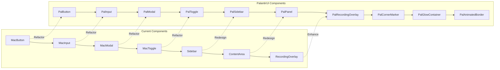
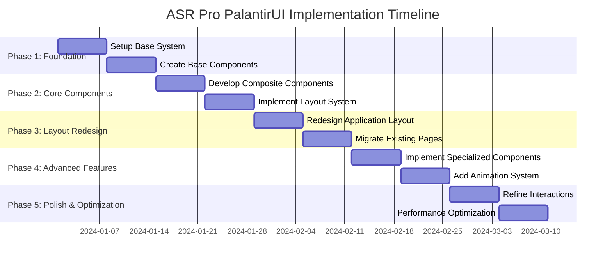
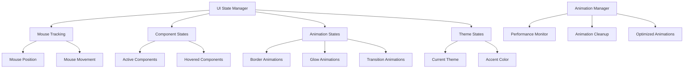

# PalantirUI Component Architecture Diagram

## Component Hierarchy Visualization

```mermaid
graph TD
    A[PalantirUI Component System] --> B[Base Components]
    A --> C[Composite Components]
    A --> D[Layout Components]
    A --> E[Specialized Components]
    
    B --> B1[PalButton]
    B --> B2[PalInput]
    B --> B3[PalToggle]
    B --> B4[PalIcon]
    B --> B5[PalText]
    
    C --> C1[PalCard]
    C --> C2[PalModal]
    C --> C3[PalDropdown]
    C --> C4[PalProgress]
    C --> C5[PalContextMenu]
    
    D --> D1[PalPanel]
    D --> D2[PalSidebar]
    D --> D3[PalHeader]
    D --> D4[PalGrid]
    D --> D5[PalContainer]
    
    E --> E1[PalRecordingOverlay]
    E --> E2[PalTranscriptionPanel]
    E --> E3[PalFileQueue]
    E --> E4[PalVisualization]
    E --> E5[PalCornerMarker]
    E --> E6[PalGlowContainer]
    E --> E7[PalAnimatedBorder]
    E --> E8[PalLayer]
```



## Migration Path Visualization



## Implementation Timeline Visualization



## State Management Flow



## Layout Structure Visualization

```mermaid
graph TD
    A[ASR Pro Application] --> B[PalHeader]
    A --> C[PalMain]
    A --> D[PalOverlayLayer]
    
    B --> B1[Logo & Title]
    B --> B2[Navigation Controls]
    B --> B3[Theme Toggle]
    
    C --> C1[PalSidebar]
    C --> C2[PalContentArea]
    
    C1 --> C1a[Navigation Items]
    C1 --> C1b[Quick Actions]
    C1 --> C1c[Status Indicators]
    
    C2 --> C2a[PalBreadcrumbs]
    C2 --> C2b[PalPageHeader]
    C2 --> C2c[PalPageContent]
    C2 --> C2d[PalStatusBar]
    
    D --> D1[PalRecordingOverlay]
    D --> D2[PalModalContainer]
    D --> D3[PalNotificationLayer]