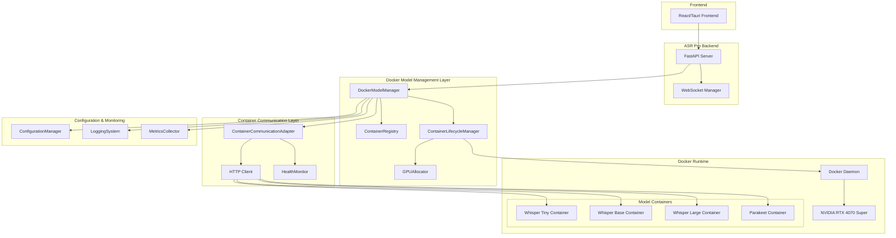
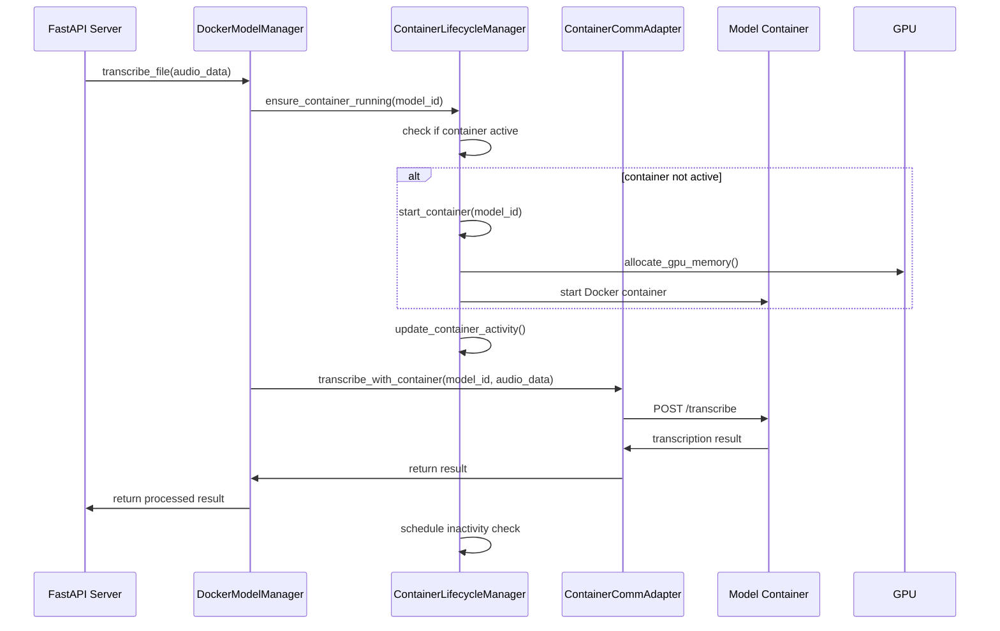

# Docker-Based ASR Architecture Design

## 1. High-Level Architecture Diagram



## 2. System Overview

The new Docker-based architecture replaces the direct ONNX model loading with containerized model execution. This approach provides better isolation, resource management, and scalability while maintaining the same API endpoints for frontend compatibility.

### Key Components:

1. **DockerModelManager**: Replaces the current ModelManager to orchestrate container-based models
2. **ContainerRegistry**: Manages metadata for available model containers
3. **ContainerLifecycleManager**: Handles container start/stop with inactivity timeout (default: 5 minutes)
4. **GPUAllocator**: Manages GPU resource allocation for containers
5. **ContainerCommunicationAdapter**: Handles communication with running containers

## 3. Detailed Component Designs

### 3.1 DockerModelManager

The DockerModelManager replaces the current ModelManager and serves as the primary interface for the FastAPI server.

```python
class DockerModelManager:
    """Manages Docker-based model containers for ASR processing."""
    
    def __init__(self, settings):
        self.settings = settings
        self.container_registry = ContainerRegistry()
        self.lifecycle_manager = ContainerLifecycleManager(settings)
        self.gpu_allocator = GPUAllocator()
        self.communication_adapter = ContainerCommunicationAdapter()
        self.current_model = None
        self.active_containers = {}
        
    async def initialize(self):
        """Initialize Docker environment and detect GPU capabilities."""
        
    async def list_available_models(self) -> List[str]:
        """List all available model containers."""
        
    async def set_model(self, model_id: str) -> bool:
        """Set active model by starting appropriate container."""
        
    async def transcribe_file(self, audio_file, model_id=None, progress_callback=None) -> Dict:
        """Transcribe audio file using containerized model."""
        
    async def get_model_info(self, model_id: str) -> Dict:
        """Get information about a model container."""
        
    async def cleanup(self):
        """Stop all active containers and cleanup resources."""
```

### 3.2 ContainerRegistry

The ContainerRegistry manages metadata for available model containers, replacing the current ModelRegistry.

```python
class ContainerRegistry:
    """Registry for available model containers."""
    
    def __init__(self):
        self._containers = self._initialize_containers()
        
    def _initialize_containers(self) -> Dict[str, Dict]:
        """Initialize container metadata with Docker image information."""
        return {
            "whisper-tiny": {
                "id": "whisper-tiny",
                "name": "Whisper Tiny (Docker)",
                "description": "OpenAI Whisper tiny model in Docker container",
                "family": "whisper",
                "size": "tiny",
                "image": "asrpro/whisper-tiny:latest",
                "port": 8001,
                "gpu_memory_mb": 2048,
                "languages": ["en", "hi"],
                "sample_rate": 16000,
            },
            "whisper-base": {
                "id": "whisper-base",
                "name": "Whisper Base (Docker)",
                "description": "OpenAI Whisper base model in Docker container",
                "family": "whisper",
                "size": "base",
                "image": "asrpro/whisper-base:latest",
                "port": 8002,
                "gpu_memory_mb": 4096,
                "languages": ["en", "hi"],
                "sample_rate": 16000,
            },
            # Additional models...
        }
        
    def list_containers(self) -> List[str]:
        """List all available container IDs."""
        
    def get_container_info(self, container_id: str) -> Optional[Dict]:
        """Get container metadata by ID."""
        
    def get_container_port(self, container_id: str) -> Optional[int]:
        """Get the port mapping for a container."""
        
    def is_container_available(self, container_id: str) -> bool:
        """Check if container is available in registry."""
```

### 3.3 ContainerLifecycleManager

The ContainerLifecycleManager handles container start/stop operations with inactivity timeout management.

```python
class ContainerLifecycleManager:
    """Manages lifecycle of model containers with inactivity timeout."""
    
    def __init__(self, settings):
        self.settings = settings
        self.inactivity_timeout = settings.get("container.inactivity_timeout", 300)  # 5 minutes default
        self.active_containers = {}  # container_id -> ContainerInstance
        self.gpu_allocator = GPUAllocator()
        
    async def start_container(self, container_id: str, container_info: Dict) -> ContainerInstance:
        """Start a container and allocate GPU resources."""
        
    async def stop_container(self, container_id: str) -> bool:
        """Stop a container and release GPU resources."""
        
    async def stop_inactive_containers(self):
        """Stop containers that have exceeded inactivity timeout."""
        
    async def update_container_activity(self, container_id: str):
        """Update the last activity timestamp for a container."""
        
    async def get_container_status(self, container_id: str) -> ContainerStatus:
        """Get the current status of a container."""
        
    async def cleanup_all_containers(self):
        """Stop all active containers."""
```

### 3.4 GPUAllocator

The GPUAllocator manages GPU resource allocation for containers, specifically for NVIDIA RTX 4070 Super.

```python
class GPUAllocator:
    """Manages GPU resource allocation for containers."""
    
    def __init__(self):
        self.total_gpu_memory = self._detect_gpu_memory()
        self.allocated_memory = 0
        self.allocations = {}  # container_id -> memory_mb
        
    def _detect_gpu_memory(self) -> int:
        """Detect total GPU memory on NVIDIA RTX 4070 Super."""
        # RTX 4070 Super has 16GB VRAM
        return 16384
        
    def can_allocate(self, memory_mb: int) -> bool:
        """Check if GPU memory can be allocated."""
        
    def allocate_gpu_memory(self, container_id: str, memory_mb: int) -> bool:
        """Allocate GPU memory for a container."""
        
    def release_gpu_memory(self, container_id: str) -> bool:
        """Release GPU memory for a container."""
        
    def get_gpu_utilization(self) -> Dict[str, Any]:
        """Get current GPU utilization statistics."""
```

### 3.5 ContainerCommunicationAdapter

The ContainerCommunicationAdapter handles communication with running containers.

```python
class ContainerCommunicationAdapter:
    """Handles communication with model containers."""
    
    def __init__(self):
        self.http_client = httpx.AsyncClient()
        self.active_connections = {}  # container_id -> base_url
        
    async def connect_to_container(self, container_id: str, port: int) -> bool:
        """Establish connection to a container endpoint."""
        
    async def transcribe_with_container(self, container_id: str, audio_data: bytes) -> Dict:
        """Send transcription request to container."""
        
    async def check_container_health(self, container_id: str) -> bool:
        """Check if container is responding to health checks."""
        
    async def disconnect_from_container(self, container_id: str):
        """Close connection to container."""
        
    async def cleanup_connections(self):
        """Close all active connections."""
```

## 4. API Design for Container Communication

### 4.1 Container API Specification

Each model container will expose a simple REST API:

```
POST /transcribe
Content-Type: multipart/form-data

Parameters:
- file: Audio file to transcribe
- response_format: json|text|srt (optional)

Response:
{
  "text": "Transcribed text",
  "segments": [
    {
      "start": 0.0,
      "end": 5.2,
      "text": "First segment"
    }
  ],
  "language": "en",
  "language_probability": 0.95,
  "duration": 5.2,
  "timing": {
    "total_processing_time": 2.1,
    "ai_transcription_time": 1.8,
    "real_time_factor": 2.48
  }
}

GET /health

Response:
{
  "status": "healthy",
  "model_id": "whisper-base",
  "gpu_available": true,
  "memory_usage_mb": 3072
}
```

### 4.2 Container Communication Flow



## 5. Configuration Management

### 5.1 Docker Configuration Settings

```python
# New configuration section for Docker settings
"docker": {
    "host": "unix:///var/run/docker.sock",  # Default Docker socket
    "registry_url": "https://registry.hub.docker.com",
    "container_network": "asrpro-network",
    "gpu_driver": "nvidia",
    "container_timeout": 30,  # Container startup timeout in seconds
    "health_check_interval": 30,  # Health check interval in seconds
    "max_concurrent_containers": 3,  # Max containers running simultaneously
    "inactivity_timeout": 300,  # 5 minutes default
    "pull_policy": "if_missing"  # always|never|if_missing
}
```

### 5.2 Model Container Configuration

```python
"model_containers": {
    "whisper-tiny": {
        "image": "asrpro/whisper-tiny:latest",
        "port": 8001,
        "gpu_memory_mb": 2048,
        "environment": {
            "MODEL_NAME": "whisper-tiny",
            "DEVICE": "cuda",
            "COMPUTE_TYPE": "float16"
        },
        "volumes": {
            "/tmp/asrpro": "/tmp/asrpro"
        },
        "restart_policy": "unless-stopped"
    },
    "whisper-base": {
        "image": "asrpro/whisper-base:latest",
        "port": 8002,
        "gpu_memory_mb": 4096,
        "environment": {
            "MODEL_NAME": "whisper-base",
            "DEVICE": "cuda",
            "COMPUTE_TYPE": "float16"
        },
        "volumes": {
            "/tmp/asrpro": "/tmp/asrpro"
        },
        "restart_policy": "unless-stopped"
    }
}
```

## 6. Error Handling and Recovery Mechanisms

### 6.1 Container Startup Failures

- **Image Pull Failures**: Implement retry logic with exponential backoff
- **GPU Allocation Failures**: Fallback to CPU-only containers or queue requests
- **Port Conflicts**: Dynamic port allocation with registry tracking
- **Docker Daemon Issues**: Automatic reconnection attempts with circuit breaker pattern

### 6.2 Runtime Failures

- **Container Crashes**: Automatic restart with exponential backoff
- **Health Check Failures**: Container restart and notification
- **GPU Memory Exhaustion**: Intelligent container prioritization and cleanup
- **Network Issues**: Retry with timeout and connection pooling

### 6.3 Recovery Strategies

```python
class ContainerRecoveryManager:
    """Handles recovery from container failures."""
    
    def __init__(self, lifecycle_manager, gpu_allocator):
        self.lifecycle_manager = lifecycle_manager
        self.gpu_allocator = gpu_allocator
        self.failure_counts = {}  # container_id -> failure_count
        self.backoff_intervals = [30, 60, 120, 300]  # seconds
        
    async def handle_container_failure(self, container_id: str, error: Exception):
        """Handle container failure with appropriate recovery strategy."""
        
    async def schedule_container_restart(self, container_id: str, delay: int):
        """Schedule container restart with delay."""
        
    async def force_cleanup_container(self, container_id: str):
        """Force cleanup of failed container."""
        
    async def check_and_recover_containers(self):
        """Periodic check for container recovery."""
```

## 7. Monitoring and Logging

### 7.1 Container Monitoring

- **Resource Utilization**: GPU memory, CPU usage, container memory
- **Performance Metrics**: Transcription speed, queue depth, response times
- **Health Status**: Container uptime, restart counts, error rates
- **Availability Metrics**: Container readiness, model loading times

### 7.2 Logging Strategy

```python
class ContainerLogger:
    """Structured logging for container operations."""
    
    def __init__(self):
        self.logger = logging.getLogger("container_manager")
        
    def log_container_start(self, container_id: str, startup_time: float):
        """Log container startup event."""
        
    def log_container_stop(self, container_id: str, uptime: float):
        """Log container stop event."""
        
    def log_transcription_request(self, container_id: str, audio_size: int, processing_time: float):
        """Log transcription request."""
        
    def log_gpu_allocation(self, container_id: str, memory_mb: int, total_allocated: int):
        """Log GPU allocation event."""
        
    def log_error(self, container_id: str, error: Exception, context: Dict):
        """Log error with context."""
```

### 7.3 Metrics Collection

```python
class ContainerMetricsCollector:
    """Collects and reports container metrics."""
    
    def __init__(self):
        self.metrics = {
            "container_startups": Counter(),
            "container_stops": Counter(),
            "transcription_requests": Counter(),
            "transcription_errors": Counter(),
            "gpu_utilization": Gauge(),
            "container_uptime": Histogram(),
            "processing_time": Histogram()
        }
        
    def record_container_startup(self, container_id: str, startup_time: float):
        """Record container startup metrics."""
        
    def record_transcription(self, container_id: str, processing_time: float, audio_duration: float):
        """Record transcription metrics."""
        
    def record_gpu_utilization(self, allocated_mb: int, total_mb: int):
        """Record GPU utilization metrics."""
        
    def get_metrics_summary(self) -> Dict:
        """Get summary of all collected metrics."""
```

## 8. Migration Strategy

### 8.1 Phase 1: Parallel Implementation

1. Implement Docker-based components alongside existing ONNX implementation
2. Add configuration flag to switch between ONNX and Docker modes
3. Implement compatibility layer to maintain same API endpoints
4. Add comprehensive logging for both implementations

### 8.2 Phase 2: Testing and Validation

1. Run parallel transcription jobs comparing ONNX vs Docker results
2. Performance benchmarking on RTX 4070 Super
3. Stress testing with concurrent requests
4. Validation of transcription accuracy across models

### 8.3 Phase 3: Gradual Migration

1. Enable Docker mode for specific models (whisper-tiny first)
2. Monitor performance and error rates
3. Gradually migrate all models to Docker containers
4. Remove ONNX implementation after validation

### 8.4 Phase 4: Optimization

1. Fine-tune container configurations for RTX 4070 Super
2. Optimize GPU allocation and memory management
3. Implement advanced features (container preloading, model caching)
4. Performance optimization based on production metrics

## 9. File Structure Changes

### 9.1 New Files

```
sidecar/
├── models/
│   ├── docker/
│   │   ├── __init__.py
│   │   ├── manager.py          # DockerModelManager
│   │   ├── registry.py         # ContainerRegistry
│   │   ├── lifecycle.py        # ContainerLifecycleManager
│   │   ├── gpu_allocator.py    # GPUAllocator
│   │   ├── communication.py    # ContainerCommunicationAdapter
│   │   └── recovery.py         # ContainerRecoveryManager
│   └── monitoring/
│       ├── __init__.py
│       ├── logger.py           # ContainerLogger
│       └── metrics.py          # ContainerMetricsCollector
├── docker/
│   ├── compose.yml             # Docker Compose for development
│   ├── containers/
│   │   ├── whisper-tiny/
│   │   │   └── Dockerfile
│   │   ├── whisper-base/
│   │   │   └── Dockerfile
│   │   └── parakeet/
│   │       └── Dockerfile
│   └── scripts/
│       ├── build.sh
│       └── push.sh
└── config/
    └── docker_config.py        # Docker configuration management
```

### 9.2 Modified Files

```
sidecar/
├── config/
│   └── settings.py             # Add Docker configuration
├── api/
│   └── server.py               # Update to use DockerModelManager
├── models/
│   └── manager.py              # Refactor as compatibility layer
└── requirements.txt            # Add Docker SDK dependencies
```

## 10. Implementation Roadmap

### 10.1 Sprint 1: Core Infrastructure (2 weeks)
- Implement DockerModelManager with basic container management
- Create ContainerRegistry with model metadata
- Implement ContainerLifecycleManager with inactivity timeout
- Set up basic container communication
- Create configuration management for Docker settings

### 10.2 Sprint 2: GPU Management and Communication (2 weeks)
- Implement GPUAllocator for RTX 4070 Super
- Build ContainerCommunicationAdapter with HTTP client
- Add health checking and monitoring
- Implement error handling for container failures
- Create logging and metrics collection

### 10.3 Sprint 3: Container Development (2 weeks)
- Develop Docker images for Whisper models
- Create container API endpoints
- Implement container startup scripts
- Add GPU support to containers
- Test container functionality

### 10.4 Sprint 4: Integration and Testing (2 weeks)
- Integrate Docker components with FastAPI server
- Implement compatibility layer for existing API
- Add comprehensive error handling and recovery
- Perform performance testing and optimization
- Create migration scripts and documentation

### 10.5 Sprint 5: Production Deployment (1 week)
- Final testing and validation
- Production configuration setup
- Monitoring and alerting configuration
- Documentation completion
- Production deployment

## 11. Benefits of Docker-Based Architecture

1. **Simplified Codebase**: Removes complex ONNX runtime management
2. **Better Resource Isolation**: Containers provide clean separation
3. **Improved Scalability**: Easy to scale horizontally
4. **Simplified Deployment**: Container-based deployment is more consistent
5. **Better GPU Utilization**: More efficient GPU memory management
6. **Enhanced Reliability**: Container restarts and recovery mechanisms
7. **Easier Maintenance**: Separate container lifecycle from application
8. **Future-Proof**: Easy to add new models without code changes