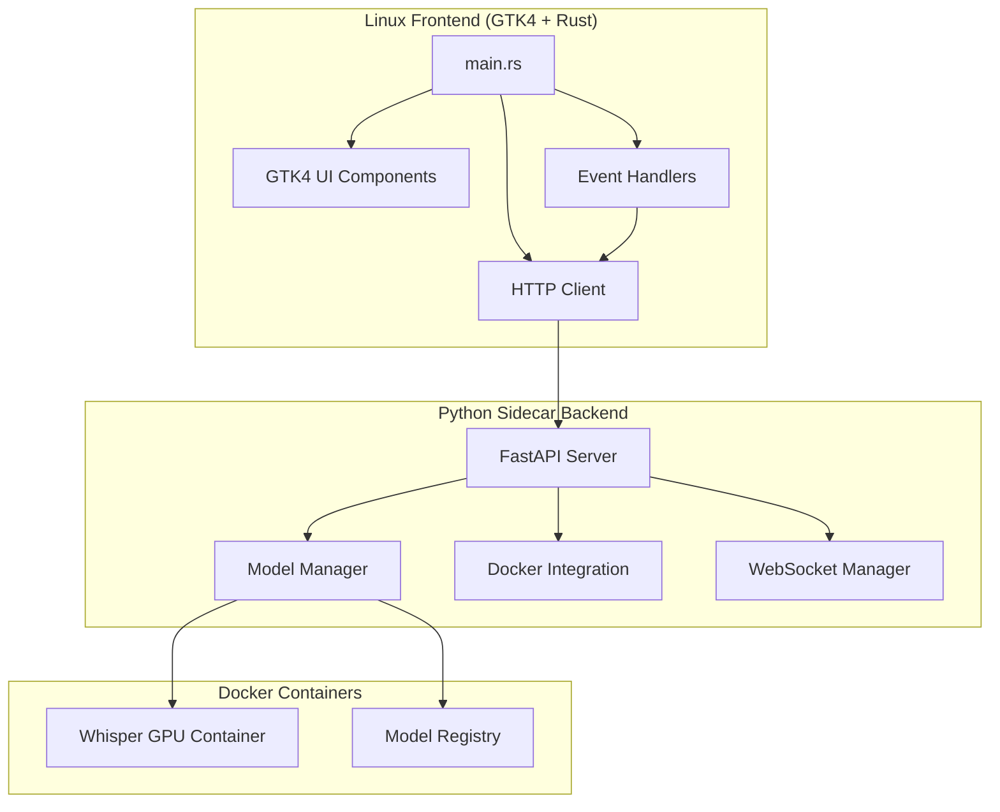

# ASRPro Linux Frontend Architectural Analysis

## Overview

This document provides a comprehensive analysis of the proposed GTK4-based Linux frontend for ASRPro, evaluating its architecture, strengths, weaknesses, and integration with the Python sidecar backend.

## Current Architecture

### Frontend Structure

The Linux frontend is built using GTK4 with Rust as the primary language. The current implementation follows a basic client-server architecture:



### Key Components

1. **GTK4 UI Framework**: Provides native Linux desktop experience
2. **Rust Implementation**: Ensures performance and memory safety
3. **HTTP Client**: Communicates with Python backend via REST API
4. **Meson Build System**: Manages compilation and dependencies

## Evaluation of Proposed Structure

### Strengths

#### 1. Native Linux Integration
- **GTK4** provides excellent integration with Linux desktop environments
- Native look and feel across different desktop environments (GNOME, KDE, XFCE)
- Supports accessibility features out of the box
- Proper handling of system themes and icons

#### 2. Performance and Safety
- **Rust** offers memory safety without garbage collection
- Zero-cost abstractions ensure optimal performance
- Strong type system reduces runtime errors
- Excellent async/await support for non-blocking operations

#### 3. Modern Tooling
- **Cargo** provides robust dependency management
- **Meson** build system integrates well with Linux ecosystem
- Excellent debugging and profiling tools available

#### 4. Separation of Concerns
- Clear separation between UI and business logic
- Backend remains platform-agnostic (Python)
- Frontend focuses solely on presentation and user interaction

### Weaknesses

#### 1. Limited Feature Implementation
- Current implementation only provides basic UI testing
- No actual audio file upload or transcription functionality
- Missing real-time progress updates
- No model selection or configuration UI

#### 2. Error Handling
- Basic error handling with simple dialog boxes
- No retry mechanisms for failed requests
- Limited offline functionality
- No graceful degradation when backend is unavailable

#### 3. User Experience
- Minimal UI with only basic components
- No drag-and-drop support for audio files
- Missing keyboard shortcuts
- No settings or preferences interface

#### 4. Integration Challenges
- No WebSocket implementation for real-time updates
- Limited configuration options
- No integration with system file managers
- Missing system tray or notification support

## Missing Components

### 1. Audio Processing
```rust
// Missing audio file handling
pub struct AudioFile {
    path: PathBuf,
    format: AudioFormat,
    metadata: AudioMetadata,
}

// Missing audio preview functionality
pub fn create_audio_preview_widget() -> Widget {
    // Implementation needed
}
```

### 2. Model Management UI
```rust
// Missing model selection interface
pub struct ModelSelector {
    available_models: Vec<Model>,
    current_model: Option<Model>,
}

// Missing model configuration
pub struct ModelConfig {
    language: String,
    task: TranscriptionTask,
    temperature: f32,
}
```

### 3. Real-time Progress Updates
```rust
// Missing WebSocket client
pub struct WebSocketClient {
    sender: mpsc::Sender<Message>,
    receiver: mpsc::Receiver<Message>,
}

// Missing progress visualization
pub struct ProgressWidget {
    progress_bar: ProgressBar,
    status_label: Label,
}
```

### 4. File Management
```rust
// Missing file drag-and-drop
pub struct FileDropTarget {
    on_file_dropped: Box<dyn Fn(PathBuf)>,
}

// Missing recent files handling
pub struct RecentFilesManager {
    recent_files: VecDeque<PathBuf>,
    max_files: usize,
}
```

## Integration with Python Sidecar Backend

### Current Integration

The frontend currently connects to the Python backend via HTTP:

```rust
const BACKEND_URL: &str = "http://localhost:8000";

// Basic health check
async fn check_backend_health() -> Result<String, Box<dyn std::error::Error>> {
    let response = http_client.get(&format!("{}/health", BACKEND_URL)).send().await?;
    // Process response
}
```

### Required Integration Points

1. **Authentication**
   ```rust
   // Missing authentication handling
   pub struct AuthManager {
       token: Option<String>,
       refresh_token: Option<String>,
   }
   ```

2. **File Upload**
   ```rust
   // Missing multipart form data support
   async fn upload_audio_file(file_path: &Path) -> Result<TranscriptionResponse, Error> {
       // Implementation needed
   }
   ```

3. **WebSocket Connection**
   ```rust
   // Missing real-time updates
   async fn connect_websocket() -> Result<WebSocketStream, Error> {
       // Implementation needed
   }
   ```

4. **Configuration Sync**
   ```rust
   // Missing settings synchronization
   pub struct ConfigSync {
       local_config: Config,
       remote_config: Option<Config>,
   }
   ```

## Recommendations for Improvements

### 1. Architecture Enhancements

#### Implement MVVM Pattern
```rust
// View Model for separating UI from business logic
pub struct TranscriptionViewModel {
    model: Arc<Mutex<Model>>,
    view_model: Arc<Mutex<ViewModel>>,
}

pub struct Model {
    audio_files: Vec<AudioFile>,
    current_transcription: Option<Transcription>,
    available_models: Vec<ModelInfo>,
}

pub struct ViewModel {
    is_transcribing: bool,
    progress: f32,
    status_message: String,
}
```

#### Add State Management
```rust
// Centralized state management
pub struct AppState {
    audio_files: RefCell<Vec<AudioFile>>,
    current_model: RefCell<Option<ModelInfo>>,
    transcriptions: RefCell<HashMap<Uuid, Transcription>>,
    settings: RefCell<Settings>,
}
```

### 2. User Interface Improvements

#### Enhanced File Handling
```rust
// Drag and drop support
impl FileDropTarget {
    pub fn new() -> Self {
        // Implement drag-and-drop functionality
    }
    
    pub fn connect_file_dropped<F: Fn(PathBuf) + 'static>(&self, f: F) {
        // Connect callback for dropped files
    }
}
```

#### Progress Visualization
```rust
// Real-time progress widget
pub struct TranscriptionProgress {
    progress_bar: ProgressBar,
    time_remaining: Label,
    current_file: Label,
    waveform: WaveformWidget,
}
```

### 3. Backend Integration

#### WebSocket Implementation
```rust
pub struct WebSocketManager {
    client: tungstenite::WebSocket<tokio::net::TcpStream>,
    handlers: HashMap<String, Box<dyn Fn(Value)>>,
}

impl WebSocketManager {
    pub async fn connect(url: &str) -> Result<Self, Error> {
        // Connect to WebSocket endpoint
    }
    
    pub async fn send_message(&mut self, message: &str) -> Result<(), Error> {
        // Send message to server
    }
    
    pub fn register_handler<F: Fn(Value) + 'static>(&mut self, event: &str, handler: F) {
        // Register event handler
    }
}
```

### 4. Error Handling and Resilience

#### Robust Error Handling
```rust
#[derive(Debug, thiserror::Error)]
pub enum AsrProError {
    #[error("Backend connection failed: {0}")]
    BackendConnection(String),
    
    #[error("File upload failed: {0}")]
    FileUpload(String),
    
    #[error("Transcription failed: {0}")]
    Transcription(String),
    
    #[error("Configuration error: {0}")]
    Configuration(String),
}

// Retry mechanism
pub async fn retry_async<F, T, E>(f: F, max_retries: u32) -> Result<T, E>
where
    F: Fn() -> Pin<Box<dyn Future<Output = Result<T, E>>>>,
    E: std::fmt::Debug,
{
    // Implement exponential backoff retry
}
```

## Technical Considerations

### 1. Dependency Management
- Current dependencies are minimal but sufficient for basic functionality
- Consider adding:
  - `tokio-tungstenite` for WebSocket support
  - `drag-drop` for file handling
  - `gstreamer` for audio preview
  - `serde` for configuration serialization

### 2. Threading Model
- GTK4 requires UI operations on the main thread
- Use `glib::MainContext` for async operations
- Implement proper channel communication between threads

### 3. Memory Management
- Leverage Rust's ownership system
- Use `Arc<Mutex<T>>` for shared state
- Implement proper cleanup for resources

### 4. Platform Integration
- Implement XDG desktop entry for application menu
- Add MIME type registration for supported audio formats
- Support system notifications for transcription completion

## Conclusion

The proposed GTK4 + Rust architecture provides a solid foundation for the ASRPro Linux frontend. While the current implementation is basic, it demonstrates the core concepts and integration points. The recommended improvements will transform it into a feature-rich, native Linux application that provides an excellent user experience while maintaining the performance and safety benefits of Rust.

The separation between frontend and backend remains a key strength, allowing each component to evolve independently while maintaining clear API boundaries. This architecture will support future enhancements and platform-specific optimizations without compromising the overall system design.