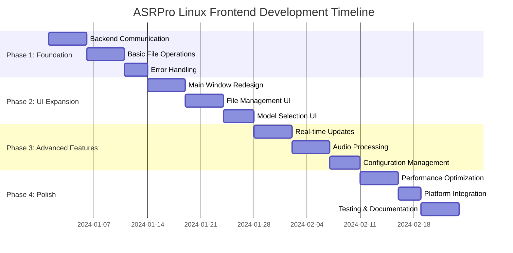

# ASRPro Linux Frontend Development Roadmap

## Overview

This roadmap outlines the development timeline, priorities, and milestones for the GTK4-based Linux frontend of ASRPro. It provides a clear path from the current basic implementation to a fully-featured, production-ready application.

## Development Timeline



## Immediate Next Steps (First 2-3 Weeks)

### Week 1: Backend Communication Enhancement

#### Priority 1: Robust HTTP Client Implementation
- **File to modify**: [`src/main.rs`](frontends/linux/src/main.rs:1)
- **New files to create**:
  - [`src/services/backend_client.rs`](frontends/linux/src/services/backend_client.rs:1)
  - [`src/utils/error.rs`](frontends/linux/src/utils/error.rs:1)

**Implementation details**:
```rust
// src/services/backend_client.rs
use reqwest::{Client, Response};
use serde_json::Value;
use crate::utils::error::{AsrProError, Result};

pub struct BackendClient {
    client: Client,
    base_url: String,
}

impl BackendClient {
    pub fn new(base_url: String) -> Self {
        Self {
            client: Client::builder()
                .timeout(std::time::Duration::from_secs(30))
                .build()
                .unwrap(),
            base_url,
        }
    }
    
    pub async fn health_check(&self) -> Result<HealthStatus> {
        let response = self.client
            .get(&format!("{}/health", self.base_url))
            .send()
            .await
            .map_err(|e| AsrProError::BackendConnection { source: e })?;
        
        if response.status().is_success() {
            let health: HealthStatus = response.json().await
                .map_err(|e| AsrProError::BackendConnection { source: e })?;
            Ok(health)
        } else {
            Err(AsrProError::BackendConnection {
                source: reqwest::Error::from(
                    response.error_for_status().unwrap_err()
                )
            })
        }
    }
}

#[derive(serde::Deserialize)]
pub struct HealthStatus {
    pub status: String,
    pub current_model: Option<String>,
    pub device: Option<String>,
}
```

#### Priority 2: Error Handling System
- **New file to create**: [`src/utils/error.rs`](frontends/linux/src/utils/error.rs:1)

**Implementation details**:
```rust
// src/utils/error.rs
use thiserror::Error;

#[derive(Debug, Error)]
pub enum AsrProError {
    #[error("Backend connection failed: {source}")]
    BackendConnection { source: reqwest::Error },
    
    #[error("File operation failed: {path} - {source}")]
    FileOperation { 
        path: std::path::PathBuf, 
        source: std::io::Error 
    },
    
    #[error("Transcription failed: {message}")]
    Transcription { message: String },
    
    #[error("Configuration error: {message}")]
    Configuration { message: String },
}

pub type Result<T> = std::result::Result<T, AsrProError>;
```

### Week 2: Basic File Operations

#### Priority 1: File Upload Implementation
- **File to modify**: [`src/main.rs`](frontends/linux/src/main.rs:1)
- **New files to create**:
  - [`src/services/file_manager.rs`](frontends/linux/src/services/file_manager.rs:1)
  - [`src/models/audio_file.rs`](frontends/linux/src/models/audio_file.rs:1)

**Implementation details**:
```rust
// src/services/file_manager.rs
use crate::models::audio_file::AudioFile;
use crate::utils::error::{AsrProError, Result};
use std::path::PathBuf;

pub struct FileManager {
    supported_formats: Vec<String>,
}

impl FileManager {
    pub fn new() -> Self {
        let supported_formats = vec![
            "wav".to_string(), "mp3".to_string(), "m4a".to_string(),
            "flac".to_string(), "ogg".to_string(), "aac".to_string(),
            "mp4".to_string(), "avi".to_string(), "mkv".to_string(),
        ];
        
        Self { supported_formats }
    }
    
    pub fn validate_file(&self, path: &PathBuf) -> Result<AudioFile> {
        if !path.exists() {
            return Err(AsrProError::FileOperation {
                path: path.clone(),
                source: std::io::Error::new(
                    std::io::ErrorKind::NotFound,
                    "File not found"
                ),
            });
        }
        
        if let Some(extension) = path.extension() {
            if let Some(ext_str) = extension.to_str() {
                if self.supported_formats.contains(&ext_str.to_lowercase()) {
                    return Ok(AudioFile::new(path.clone()));
                }
            }
        }
        
        Err(AsrProError::FileOperation {
            path: path.clone(),
            source: std::io::Error::new(
                std::io::ErrorKind::InvalidInput,
                "Unsupported file format"
            ),
        })
    }
    
    pub async fn upload_file(&self, file: &AudioFile, backend: &BackendClient) -> Result<TranscriptionResult> {
        // Implementation for file upload
    }
}
```

#### Priority 2: Enhanced UI Components
- **File to modify**: [`src/main.rs`](frontends/linux/src/main.rs:1)
- **New files to create**:
  - [`src/ui/file_panel.rs`](frontends/linux/src/ui/file_panel.rs:1)
  - [`src/ui/progress_dialog.rs`](frontends/linux/src/ui/progress_dialog.rs:1)

### Week 3: Error Handling and Basic Settings

#### Priority 1: Configuration Management
- **New files to create**:
  - [`src/services/config_manager.rs`](frontends/linux/src/services/config_manager.rs:1)
  - [`src/models/settings.rs`](frontends/linux/src/models/settings.rs:1)

**Implementation details**:
```rust
// src/services/config_manager.rs
use crate::models::settings::Settings;
use crate::utils::error::{AsrProError, Result};
use std::path::PathBuf;

pub struct ConfigManager {
    config_path: PathBuf,
}

impl ConfigManager {
    pub fn new() -> Self {
        let config_path = dirs::config_dir()
            .unwrap_or_else(|| PathBuf::from("."))
            .join("asrpro")
            .join("config.json");
        
        Self { config_path }
    }
    
    pub fn load_settings(&self) -> Result<Settings> {
        if self.config_path.exists() {
            let content = std::fs::read_to_string(&self.config_path)
                .map_err(|e| AsrProError::FileOperation {
                    path: self.config_path.clone(),
                    source: e,
                })?;
            
            let settings: Settings = serde_json::from_str(&content)
                .map_err(|e| AsrProError::Configuration {
                    message: format!("Failed to parse config: {}", e),
                })?;
            
            Ok(settings)
        } else {
            Ok(Settings::default())
        }
    }
    
    pub fn save_settings(&self, settings: &Settings) -> Result<()> {
        // Ensure directory exists
        if let Some(parent) = self.config_path.parent() {
            std::fs::create_dir_all(parent)
                .map_err(|e| AsrProError::FileOperation {
                    path: parent.to_path_buf(),
                    source: e,
                })?;
        }
        
        let content = serde_json::to_string_pretty(settings)
            .map_err(|e| AsrProError::Configuration {
                message: format!("Failed to serialize config: {}", e),
            })?;
        
        std::fs::write(&self.config_path, content)
            .map_err(|e| AsrProError::FileOperation {
                path: self.config_path.clone(),
                source: e,
            })?;
        
        Ok(())
    }
}
```

## File Modifications vs. New Files

### Files to Modify

1. **[`src/main.rs`](frontends/linux/src/main.rs:1)**
   - Update to use new modular structure
   - Implement proper application lifecycle
   - Add initialization of services

2. **[`Cargo.toml`](frontends/linux/Cargo.toml:1)**
   - Add new dependencies for WebSocket, audio processing, etc.
   - Update version information

3. **[`meson.build`](frontends/linux/meson.build:1)**
   - Add new dependencies (GStreamer, etc.)
   - Update resource compilation

4. **[`data/style.css`](frontends/linux/data/style.css:1)**
   - Add styles for new UI components
   - Implement theme support

### New Files to Create

#### Core Structure
- [`src/app.rs`](frontends/linux/src/app.rs:1) - Application struct and setup
- [`src/models/mod.rs`](frontends/linux/src/models/mod.rs:1) - Models module
- [`src/services/mod.rs`](frontends/linux/src/services/mod.rs:1) - Services module
- [`src/ui/mod.rs`](frontends/linux/src/ui/mod.rs:1) - UI components module
- [`src/utils/mod.rs`](frontends/linux/src/utils/mod.rs:1) - Utilities module

#### Model Files
- [`src/models/app_state.rs`](frontends/linux/src/models/app_state.rs:1) - Application state
- [`src/models/audio_file.rs`](frontends/linux/src/models/audio_file.rs:1) - Audio file model
- [`src/models/transcription.rs`](frontends/linux/src/models/transcription.rs:1) - Transcription data
- [`src/models/settings.rs`](frontends/linux/src/models/settings.rs:1) - Settings model

#### Service Files
- [`src/services/backend_client.rs`](frontends/linux/src/services/backend_client.rs:1) - HTTP client
- [`src/services/file_manager.rs`](frontends/linux/src/services/file_manager.rs:1) - File operations
- [`src/services/config_manager.rs`](frontends/linux/src/services/config_manager.rs:1) - Configuration

#### UI Component Files
- [`src/ui/main_window.rs`](frontends/linux/src/ui/main_window.rs:1) - Main window
- [`src/ui/file_panel.rs`](frontends/linux/src/ui/file_panel.rs:1) - File management
- [`src/ui/progress_dialog.rs`](frontends/linux/src/ui/progress_dialog.rs:1) - Progress indication

#### Utility Files
- [`src/utils/error.rs`](frontends/linux/src/utils/error.rs:1) - Error types
- [`src/utils/async_utils.rs`](frontends/linux/src/utils/async_utils.rs:1) - Async utilities

## Testing Strategy

### Unit Testing

#### Test Structure
```
tests/
├── unit/
│   ├── models_tests.rs      # Test data models
│   ├── services_tests.rs    # Test business logic
│   └── utils_tests.rs       # Test utility functions
└── integration/
    ├── backend_tests.rs     # Test backend integration
    └── file_tests.rs        # Test file operations
```

#### Test Implementation Example
```rust
// tests/unit/services_tests.rs
use asrpro_gtk4::services::file_manager::FileManager;
use asrpro_gtk4::utils::error::Result;
use std::path::PathBuf;
use tempfile::NamedTempFile;

#[tokio::test]
async fn test_file_manager_validation() {
    let file_manager = FileManager::new();
    
    // Test valid file
    let temp_file = NamedTempFile::with_suffix(".wav").unwrap();
    let result = file_manager.validate_file(&temp_file.path().to_path_buf());
    assert!(result.is_ok());
    
    // Test invalid file
    let invalid_file = PathBuf::from("test.txt");
    let result = file_manager.validate_file(&invalid_file);
    assert!(result.is_err());
}

#[tokio::test]
async fn test_backend_client_health_check() {
    // This would require a mock backend server
    // Implementation would depend on the mocking strategy chosen
}
```

### Integration Testing

#### Mock Backend Server
```rust
// tests/integration/backend_tests.rs
use mockito::{mock, Server};
use asrpro_gtk4::services::backend_client::BackendClient;

#[tokio::test]
async fn test_health_check_integration() {
    let mut server = Server::new();
    
    let mock = mock("GET", "/health")
        .with_status(200)
        .with_header("content-type", "application/json")
        .with_body(r#"{"status": "healthy", "current_model": "whisper-base", "device": "cpu"}"#)
        .create();
    
    let client = BackendClient::new(server.url());
    let result = client.health_check().await;
    
    assert!(result.is_ok());
    let health = result.unwrap();
    assert_eq!(health.status, "healthy");
    assert_eq!(health.current_model, Some("whisper-base".to_string()));
}
```

### UI Testing

#### GTK4 Testing Approach
```rust
// tests/integration/ui_tests.rs
use gtk4::prelude::*;
use gtk4::{Application, ApplicationWindow};

#[test]
fn test_main_window_creation() {
    let app = Application::builder()
        .application_id("com.asrpro.gtk4.test")
        .build();
    
    app.connect_activate(|app| {
        let window = ApplicationWindow::builder()
            .application(app)
            .title("ASRPro Test")
            .build();
        
        window.present();
    });
    
    // Run the application and verify window creation
    // This would require additional setup for proper testing
}
```

## Potential Blockers and Mitigations

### 1. GTK4 Learning Curve
**Blocker**: Team unfamiliar with GTK4 and Rust GUI development

**Mitigation**:
- Allocate time for GTK4 documentation review
- Create simple prototype components before full implementation
- Leverage existing GTK4 examples and tutorials
- Consider pairing with experienced GTK4 developers

### 2. Async/Threading Complexity
**Blocker**: GTK4's main thread requirement complicates async operations

**Mitigation**:
- Use `glib::MainContext` for async operations
- Implement proper channel communication between threads
- Create utility functions for common async patterns
- Establish clear threading guidelines early

### 3. Backend API Changes
**Blocker**: Python backend API may evolve during development

**Mitigation**:
- Implement flexible API client with version negotiation
- Create mock server for testing independent of backend
- Maintain clear API contract documentation
- Implement feature detection for optional backend features

### 4. Audio Processing Complexity
**Blocker**: Audio preview and waveform visualization may be complex

**Mitigation**:
- Start with basic file information display
- Implement audio preview as a separate phase
- Consider using existing GStreamer components
- Evaluate third-party audio libraries if needed

### 5. Cross-Distribution Compatibility
**Blocker**: Different Linux distributions may have varying GTK4 versions

**Mitigation**:
- Target widely available GTK4 version (4.6+)
- Implement runtime version checking
- Provide clear dependency documentation
- Consider AppImage/Flatpak for distribution

## Success Criteria

### Phase 1 Success Criteria (Weeks 1-2)

1. **Backend Communication**
   - [ ] Successfully connect to Python backend
   - [ ] Handle connection failures gracefully
   - [ ] Implement retry mechanism with exponential backoff
   - [ ] Parse and display backend health status

2. **File Operations**
   - [ ] Open file selection dialog
   - [ ] Validate audio/video file formats
   - [ ] Upload files to backend
   - [ ] Display upload progress

3. **Error Handling**
   - [ ] Show user-friendly error messages
   - [ ] Log technical errors for debugging
   - [ ] Recover from transient failures
   - [ ] Maintain application stability

### Phase 2 Success Criteria (Weeks 3-4)

1. **User Interface**
   - [ ] Responsive layout that adapts to window size
   - [ ] Intuitive menu structure
   - [ ] Keyboard shortcuts for common operations
   - [ ] Consistent visual design

2. **File Management**
   - [ ] Drag-and-drop file support
   - [ ] Recent files list
   - [ ] File metadata display
   - [ ] Batch file processing

3. **Model Selection**
   - [ ] Dynamic model list from backend
   - [ ] Model configuration options
   - [ ] Model download progress
   - [ ] Performance indicators

### Phase 3 Success Criteria (Weeks 5-6)

1. **Real-time Updates**
   - [ ] WebSocket connection to backend
   - [ ] Live transcription progress
   - [ ] Real-time status updates
   - [ ] Notification system

2. **Audio Processing**
   - [ ] Audio preview functionality
   - [ ] Basic waveform visualization
   - [ ] Audio format detection
   - [ ] Quality settings

3. **Configuration**
   - [ ] Settings dialog
   - [ ] Configuration persistence
   - [ ] Import/export settings
   - [ ] Advanced options

### Phase 4 Success Criteria (Weeks 7-8)

1. **Performance**
   - [ ] Application starts within 3 seconds
   - [ ] UI remains responsive during operations
   - [ ] Memory usage stays below 200MB
   - [ ] No memory leaks detected

2. **Platform Integration**
   - [ ] Desktop entry file installed
   - [ ] MIME types registered
   - [ ] System notifications work
   - [ ] File associations functional

3. **Quality Assurance**
   - [ ] Unit test coverage > 80%
   - [ ] Integration tests pass
   - [ ] No critical bugs reported
   - [ ] Documentation complete

## Conclusion

This roadmap provides a clear path for developing the ASRPro Linux frontend from its current basic state to a fully-featured, production-ready application. The phased approach ensures steady progress while maintaining code quality and user experience.

The immediate focus on backend communication and file operations will establish a solid foundation for the more advanced features. The testing strategy and success criteria ensure that each phase delivers functional, high-quality software.

By following this roadmap, the team can create a native Linux application that provides an excellent user experience while leveraging the performance and safety benefits of Rust and GTK4.